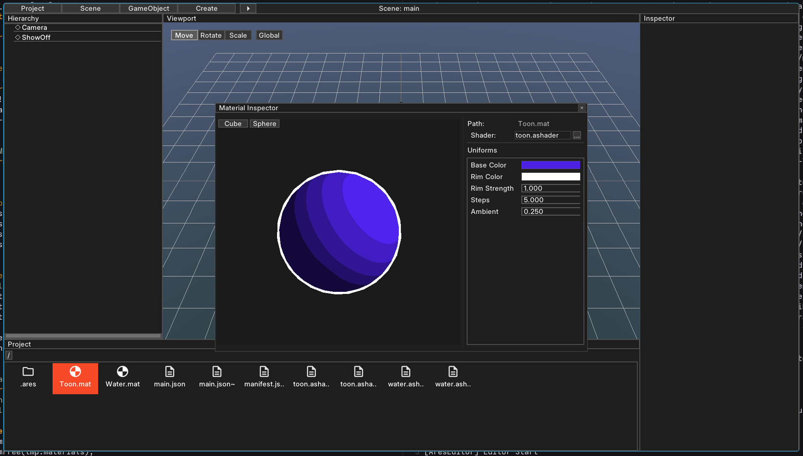
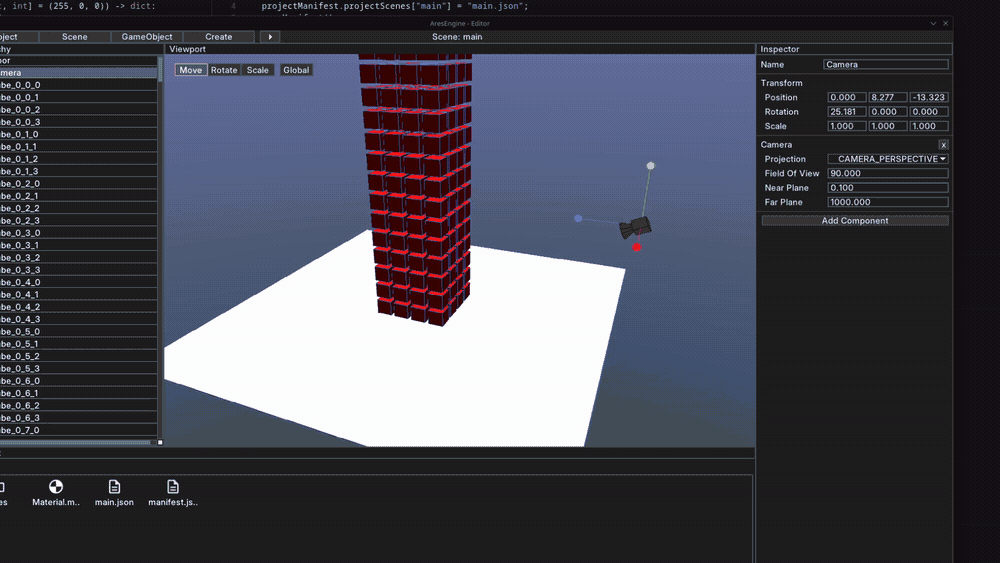
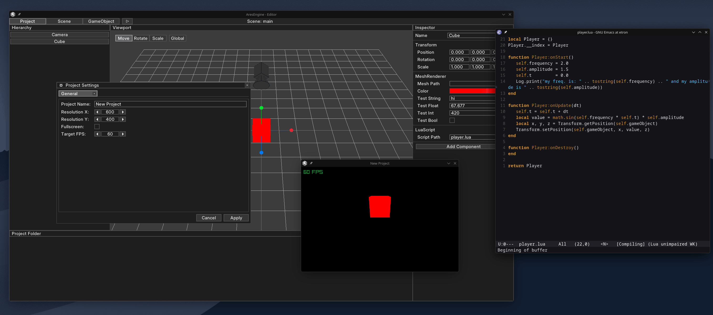

# Ares Engine

A custom 3D game engine written in D, built on top of Raylib.

- Lua Scripting
- 3D Models
- Shaders and Materials
- Custom Physics Engine

---

## Features
 
### Rendering
- Raylib backend with full 3D rendering pipeline
- Custom shader language **Ares Shader** (GLSL-based) with engine-managed uniform binding
- Per-mesh material assignment with runtime override support

### Material System
- Material assets with typed uniforms (float, int, vec2, vec3, vec4)

 
### Physics
- Custom physics engine
- Rigidbodies and static colliders
- Sphere and Box Collisions
- Triggers, Collision Events

 
### Scripting
- Lua scripting

### Editor
- Immediate-mode editor UI via raygui
- **Inspector** with auto-generated field editors via D compile-time reflection (`drawFields`)
- **Project browser** with folder navigation and asset grid
- **Material Inspector** dialog with live 3D preview (cube/sphere) and uniform editing
- Asset picker dialog for meshes, materials, and other asset types
- Draggable, singleton dialogs throughout
